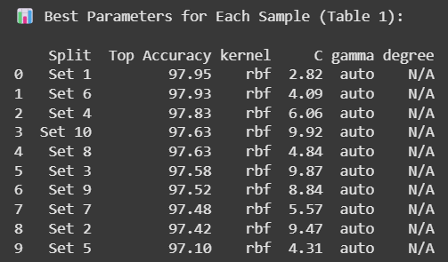
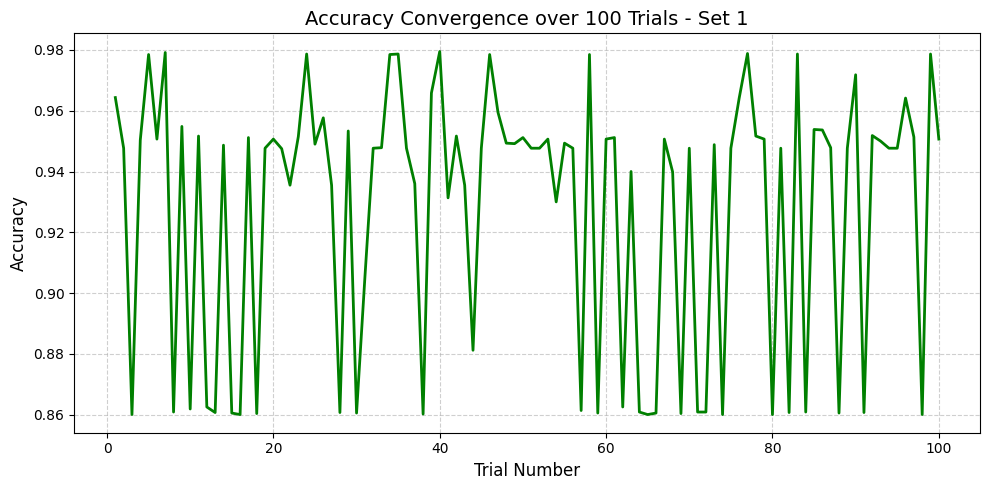

# SVM Optimization on UCI Letter Recognition Dataset

This project implements Support Vector Machine (SVM) classification on the UCI Letter Recognition Dataset, focusing on hyperparameter tuning across 10 randomized data splits. Each split undergoes 100 iterations with varied SVM configurations to analyze accuracy trends and convergence behavior.

---

## Dataset Overview

- **Dataset**: Letter Recognition  
- **Samples**: 20,000  
- **Features**: 16 numerical attributes per letter image  
- **Target Classes**: 26 (Capital letters A to Z)  
- **Source**: [UCI Machine Learning Repository](https://archive.ics.uci.edu/ml/datasets/Letter+Recognition)

---

## Methodology

- The dataset is preprocessed by encoding letter labels (A-Z) into numeric values (0–25).  
- The data is split into **10 train-test sets** using a **70% training and 30% testing ratio** with different random seeds.  

### For each split:
- 100 SVM models are trained with randomized combinations of:
  - `kernel`: `'linear'`, `'rbf'`, `'poly'`
  - `C`: Random float in range **[0.1, 10]**
  - `gamma`: `'scale'` or `'auto'` *(only for `rbf` and `poly`)*
  - `degree`: Random int in **[2, 5]** *(only for `poly`)*

- The **best accuracy** and corresponding **hyperparameters** are recorded.
- The best-performing split is visualized via an **accuracy convergence plot**.

---

##  Results

###  Final Accuracy Table

> Screenshot taken from notebook output after sorting accuracies:

###  Convergence Plot (Best Sample: S1)

> Accuracy over 100 iterations for best performing sample.

---

##  Key Insights

- The **RBF kernel** was frequently present in top-performing models.  
- **Best Accuracy observed**: ~97.95%  
- Optimal hyperparameter patterns among top models:
  - `C`: Typically between **4–6**
  - `gamma`: Often `'auto'`
  - `degree`: Only relevant when `kernel='poly'`

"""
